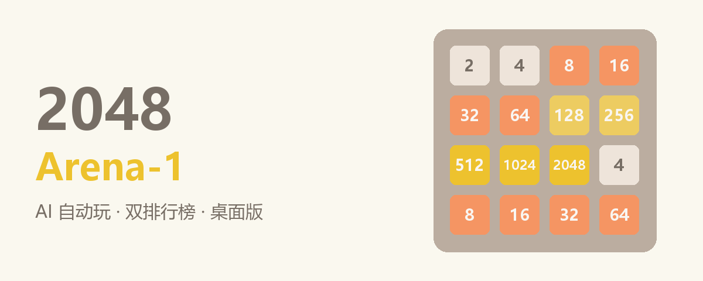

# 🎮 2048 Arena-1

> 2048 桌面竞技场 —— 经典玩法 + AI 自动玩 + 玩家/AI 排行榜

<p align="center">
  
</p>

一款完成度较高的 2048 小游戏。核心玩法之外，内置 **Expectimax 搜索的 AI 自动玩**、**玩家与 AI 双排行榜**、多尺寸棋盘、撤销、合成音效等进阶功能。界面基于 HTML5 动画实现真实手感，由 pywebview（WebView2）承载，可一键打包为 Windows 单文件 exe，双击即玩。


---

## ✨ 功能特性

### 核心玩法
- **经典 2048 手感**：平滑滑动、合并弹出、新块原地放大、加分浮动等动画
- **多尺寸棋盘**：3×3 / 4×4 / 5×5 / 6×6 / 7×7 / 8×8 自由切换
- **计分系统**：得分 / 最高分（持久化），破纪录高亮与音效；分数下方实时显示**本局最高合成数字**
- **胜负判定**：合成 2048（3×3 为 1024）胜利弹窗，可"继续游戏"挑战更高分；无路可走结束弹窗

### 进阶功能
- 🤖 **AI 自动玩**：Expectimax 搜索 + 启发式评分，随时停止；**普通 / 大师**两档强度，**0.5s / 0.75s / 1s** 三档速度可选，运行中也能实时调速
- 🏆 **排行榜**：玩家榜 / AI 榜各收录前 5 名（得分、**本局最高数字**、日期），游戏结束时自动记录，可清空
- ↩️ **撤销**：最多 100 步快照，按钮或 `Ctrl+Z`
- 🔊 **合成音效**：移动 / 合并 / 破纪录 / 胜利 / 失败 / 撤销提示音（Web Audio 合成，可静音）
- 💾 **状态持久化**：最高分、音效、棋盘尺寸、排行榜保存至本地，重启不丢

### 操作方式
方向键 / WASD / 触屏滑动，多套输入任选。

---

## 🚀 快速开始

### 方式一：直接运行 exe（推荐）
1. 从 [Releases](../../releases) 下载 `2048.exe`（或使用本地 `dist/2048-Arena-1.exe`）
2. 双击运行。Windows 10/11 自带 WebView2 运行时，无需任何安装

### 方式二：源码运行
```bash
# 1. 安装依赖（Python 3.9+）
pip install -r requirements.txt

# 2. 启动
python game/app.py
```

> 若系统缺少 WebView2 运行时，程序会弹出错误提示。

---

## 🔨 打包 exe

```bash
python build.py
```

产物：`dist/2048-Arena-1.exe`（单文件、带 2048 金色图标，约 15MB）。

---

## 📁 项目结构

```
├── game/
│   ├── app.py            # pywebview 窗口 + 持久化桥接 API + 打包资源路径
│   └── assets/
│       ├── index.html    # 完整游戏界面（样式 + 交互内嵌，约 1000 行）
│       └── logic.js      # 核心逻辑 + AI（纯函数，浏览器与 Node 共用）
├── tools/
│   ├── make_icon.py      # 生成 2048 风格应用图标
│   ├── test_logic.js     # 核心逻辑 + AI 单元测试（Node）
│   ├── smoke_test.py     # 界面冒烟测试（真实启动 pywebview 验证交互）
│   └── verify_exe.py     # 打包后 exe 运行验证（窗口 / 桥接 / 持久化）
├── build.py              # 一键打包脚本
├── requirements.txt
└── README.md
```

---

## 🤖 AI 自动玩原理

点击工具栏"🤖 自动玩"，AI 自动决策并移动。自动玩前可通过下拉选择：

- **强度**：普通（4×4 搜索深度 4）/ 大师（每档深度 +1，4×4 深度 5，更容易打出高分）
- **速度**：0.5s / 0.75s / 1s 每步间隔，**AI 运行中也能随时调速**（立即生效）

> 自动玩期间强度下拉会锁定（避免中途换档影响决策）；速度不锁定，随时可调。两者均持久化保存。

- **Expectimax 搜索**：模拟"我方走一步 → 随机生成新块（90% 生成 2 / 10% 生成 4）"的交替过程，向前搜索 3~6 层（按尺寸与强度档位自动调整），取期望得分最高的方向
- **启发式评分**（`aiScore`）：
  - 空格数量（鼓励保持棋盘空旷）
  - 行 / 列单调性（鼓励方块有序排列）
  - 平滑度（相邻方块差值小）
  - 最大块数值 + 贴角奖励（大块堆角落，稳步合成）
- **按尺寸与强度调深度**：普通档 3×3 用 depth 5、4×4 用 depth 4，大棋盘自动调浅；大师档每档 +1；实测大师档最慢约 45ms，1.5 秒间隔毫无压力
- **实测水平**：4×4 自动对局可合出 **512~1024**，优于绝大多数手动玩家

AI 逻辑全部在 `game/assets/logic.js` 中，为纯函数、无随机，可直接用 Node 测试。

---

## 🏆 排行榜

- 玩家榜 👤 与 AI 榜 🤖 **各收录前 5 名**，显示得分、最大块、日期
- 游戏结束时**自动记录**本局成绩：手动操作进玩家榜，AI 自动玩进 AI 榜
- 点击 🗑 可一键清空（带二次确认）
- 排行榜持久化保存，重启不丢

---

## 🧪 测试

```bash
# 核心逻辑 + AI 单元测试（22 项：合并规则、四方向、边界、随机不变量、AI 决策/强度/耗时）
node tools/test_logic.js

# 界面冒烟测试（真实启动 pywebview：初始化、移动、撤销、AI 自动移动、排行榜、无滚动）
python tools/smoke_test.py

# 打包后 exe 验证（启动、桥接、持久化）
python tools/verify_exe.py
```

CI（GitHub Actions）会在每次 push / PR 自动运行逻辑单元测试。

---

## 💾 数据持久化

| 内容 | 存储位置 |
| --- | --- |
| 最高分 / 音效 / 棋盘尺寸 / 排行榜 | `%APPDATA%\ZCode2048\state.json` |
| 浏览器调试模式（无 pywebview） | `localStorage`（自动回退） |

---

## 🛣 路线图

- [ ] 胜利时也可计入排行榜（当前仅结束时记录）
- [ ] 更多棋盘主题 / 自定义配色
- [ ] 对局回放 / 步骤统计
- [ ] macOS / Linux 支持
- [ ] 最高分突破音效与动画升级

---

## 📄 许可证

[MIT](LICENSE) © 2026 2048 Arena-1 贡献者
